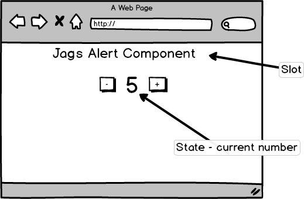

# How To Build [Stencil](https://stenciljs.com/) Components

[](https://greenkeeper.io/)

## What we're building

In this tutorial series we will be building an alert web component using Stencil



We want to build a web component that takes in two numbers:

- an initial value
- an alert value that when reached causes a custom event to be emitted

and

- allow the user to increment and decrement the value of the number
- expose a reset function allow the user to reset the values
- should use the shadow root to ensure all styling is encapsulated
- allow the user to style elements using CSS variables
- should be themeable
- and be be unit tested!

## The structure

I've created an example of each step of this series along with an explanation about why and what we're trying to achieve.

## Getting started

This very repository was created by running

```bash
npm init stencil
```


After running init delete the default components/my-component folder

## Make it better

Any suggestions or feedback are appreciated!

## Useful

Whenever you want to create a component run

```bash
npx st-cc <component-name>
```

## [Step 1 - Creating a basic component](src/components/alert-component-start/README.md)

## [Step 2 - Slots](src/components/alert-component-slots/README.md)

## [Step 3 - Props](src/components/alert-component-props/README.md)

## [Step 4 - State and handlers](src/components/alert-component-state/README.md)

## [Step 5 - Life cycle and assigning state values from props](src/components/alert-component-lifecycle/README.md)

## [Step 6 - Emitting Events](src/components/alert-component-events/README.md)

## [Step 7 - Watch](src/components/alert-component-watch/README.md)

## [Step 8 - Methods](src/components/alert-component-methods/README.md)

## [Step 9 - Styling](src/components/alert-component-styling/README.md)

## [Step 10 - Shadow Dom](src/components/alert-component-shadow-dom/README.md)

## [Step 11 - CSS variables](src/components/alert-component-css-variables/README.md)

## [Step 12 - Themes](src/components/alert-component-themes/README.md)